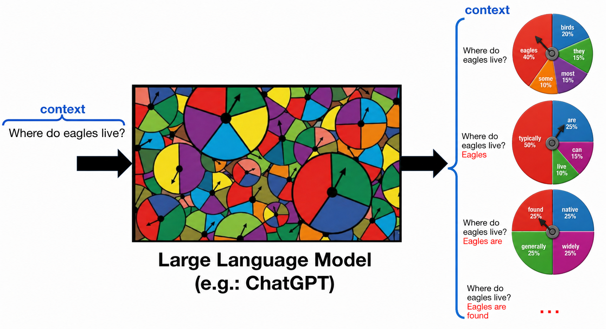

# Introdcuing the Probabilistic Foundations of Large Language Models

This repository provides a three-session unit for middle school students on how LLMs generate text through probability and sampling.

## Overview
LLMs generate text one token at a time by assigning probabilities to possible continuations and sampling from those possibilities. Because this process is invisible, users may interpret chatbot responses as fixed, certain, or retrieved directly from the internet.

This work connects familiar middle school probability (grade 7) concepts—such as coins, spinners, likelihood, experimental probability, and sampling variability—to LLM text generation.

*This visual helps students understand LLM text generation as repeated sampling from context-dependent next-word probabilities.*  

## Curriculum Structure
The learning journey is designed so learners progress through three distinct stages:

1. **Foundational Probability Activities:** Grounding learners in the basics probability
2. **Context-Dependent Text Generation:** Using spinner-based activity to simulate how a chatbot chooses the next word.
3. **Interactive Exploration:** Hands-on experience with a small LLM model and experimenting with text generation.

## Resourcses

<b> session-1/</b> (Click to expand)

<ul>
  <li><a href="./session-1/slide-deck/"><code>slide-deck/</code></a></li>
  <li><a href="./session-1/activity-1/"><code>activity-1/</code></a> - (Worksheet)</li>
  <li><a href="./session-1/activity-2/"><code>activity-2/</code></a> - (Physical and paper-based)</li>
  <li><a href="./session-1/assessment/"><code>assessment/</code></a></li>
</ul>

<b> session-2/</b> (Click to expand)

<ul>
  <li><a href="./session-2/slide-deck/"><code>slide-deck/</code></a></li>
  <li><a href="./session-2/activity-1/"><code>activity-1/</code></a> - (Physical and paper-based)</li>
  <li><a href="./session-2/activity-2/"><code>activity-2/</code></a> - (Worksheet)</li>
  <li><a href="./session-2/assessment/"><code>assessment/</code></a></li>
</ul>

<b> session-3/</b> (Click to expand)

<ul>
  <li><a href="./session-3/slide-deck/"><code>slide-deck/</code></a></li>
  <li><a href="./session-3/activity-1/"><code>activity-1/</code></a> - (Worksheet)</li>
  <li><a href="./session-3/activity-2/"><code>activity-2/</code></a> - (Worksheet)</li>
  <li><a href="./session-3/assessment/"><code>assessment/</code></a></li>
</ul>

